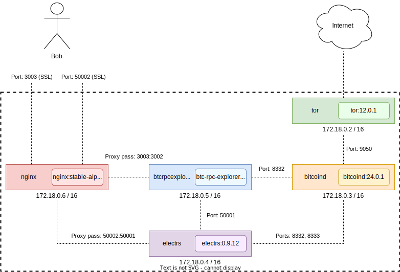

# Bitcoin full node with Docker

## Services

| Container | Service | Base image | Size |
| --- | --- | --- | --- |
| tor | Tor expert bundle 12.0.1 | debian:stable-slim | 99.6 MB |
| bitcoind | Bitcoin core daemon 24.0.1 | debian:stable-slim | 96.2 MB |
| electrs | Electrum rust service 0.9.11 | alpine:latest | 101 MB |
| btcrpcexplorer | Bitcoin explorer 3.0.3 | node:16-slim | 251 MB |
| nginx | NGINX stable | nginx:alpine-slim | 11.5 MB |

**Could the size of the containers be optimized based on Alpine images?**

The main problem is that Tor, Bitcoind and Electrs are distributed being dynamically linked to glibc. Alpine is based on musl so it's necessary to install additional packages which cause the image size to increase considerably.

More info here: https://wiki.alpinelinux.org/wiki/Running_glibc_programs