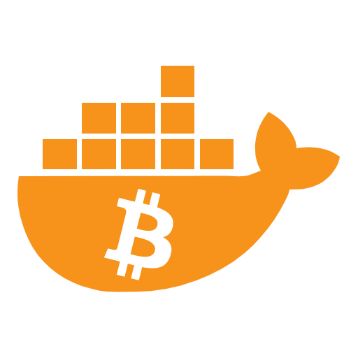

  <h1>Bitcoin full node with docker</h1>

  

  

    <strong>A simple way to deploy your own node with Docker!</strong>
  

  

  
    

  

<strong><a href="#documentation">Documentation</a> </strong>
| <strong><a href="https://github.com/reverse-hash/bitcoin-full-node-with-docker/discussions">Support</a></strong>
| <strong><a href="./FAQ.md">FAQ</a></strong>

## About the project

There are many alternatives to set up your own node. Some options seem too crafty and difficult to maintain, and others too customized that add extra complexity that makes auditing the node very difficult.

Since no option was working for me, I decided to create this project and focus on the following points:

## What to expect

As Bob, you will have a dockerized node to access on your LAN. On port 50002, <a href="https://github.com/romanz/electrs">Electrs</a> will be available to connect any Electrum compatible wallet and via HTTPS on port 3003, <a href="https://github.com/janoside/btc-rpc-explorer">BTC RPC Explorer</a> to explore the blockchain.

Your node will participate in the Bitcoin network exchanging blocks with other nodes through Tor; and optionally, it will be accesible from anywhere also through Tor.

<picture style="padding:5px">
    <source srcset=".doc/readme/diagram-dark.drawio.svg"  media="(prefers-color-scheme: dark)">
    
</picture>

The following services are deployed:

| Container      | Service                      | Base image         | Size     |
| -------------- | ---------------------------- | ------------------ | -------- |
| tor            | <a href="">Tor</a> 0.4.8.12 | debian:stable-slim | 83.2 MB |
| bitcoind       | <a href="https://github.com/bitcoin/bitcoin">Bitcoin core</a> 27.1 | debian:stable-slim | 79.8 MB |
| electrs        | <a href="https://github.com/romanz/electrs">Electrum rust service</a> 0.10.5 | debian:stable-slim | 82.5 MB |
| btcrpcexplorer | <a href="https://github.com/janoside/btc-rpc-explorer">Bitcoin RPC Explorer</a> 3.4.0 | node:22-slim | 366 MB |
| nginx          | <a href="https://github.com/nginxinc/docker-nginx">NGINX</a> stable | nginx:alpine-slim  | 11.5 MB  |

## Documentation

- <a href="./GETTING_STARTED.md">Getting started</a>
- <a href="./UPDATING_SERVICES.md">Updating services</a>

## Special thanks and attributions

- The current logo is a modification of the <a href="https://fontawesome.com/icons/docker">docker logo</a> from <a href="https://fontawesome.com">Font Awesome</a> under the (CC BY 4.0). The bitcoin logo has been added and colored orange.
- Kudos to Emmanuel Rosa for a an initial <a href="https://github.com/emmanuelrosa/bitcoin-onion-nodes">list of nodes for Tor</a>.
- Kudos to <a href="https://github.com/cozybear-dev">cozybear-dev</a> for a true multiarch Tor proxy and multiple improvements in documentation/security.
